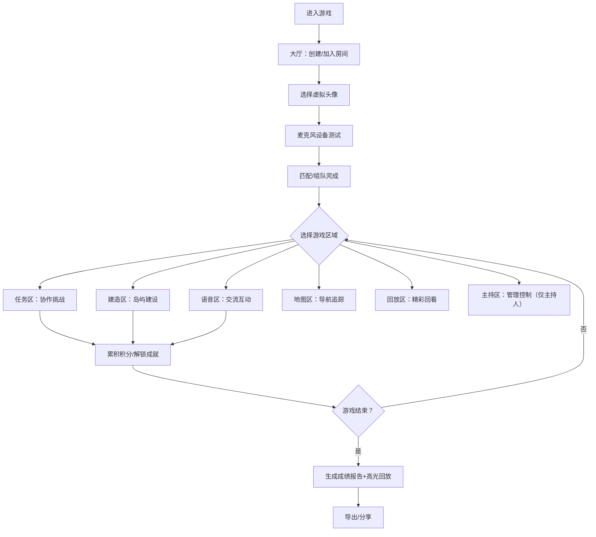

## 1. 产品概述
元宇宙团建平台是一款面向企业团建和线上破冰活动的虚拟岛屿协作桌面游戏，玩家在沉浸式虚拟环境中完成各类协作任务，增进团队凝聚力。
- 核心价值：打破地理限制，提供趣味化、沉浸式的团队协作体验，适用于远程办公团队破冰、新员工融入、部门团建等场景
- 目标用户：企业HR、团队管理者、远程办公团队成员

## 2. 核心功能

### 2.1 用户角色
| 角色 | 进入方式 | 核心权限 |
|------|----------|----------|
| 主持人 | 创建房间时自动分配 | 暂停游戏、发送提示、调整队伍、导出成绩、控制游戏流程 |
| 普通玩家 | 通过房间号加入 | 选择头像、参与任务、语音聊天、建造装饰、查看地图 |

### 2.2 功能模块
1. **大厅区域**：创建/加入房间、选择虚拟头像、随机匹配队友、麦克风测试
2. **任务区域**：拼图挑战、寻物游戏、投票决策、限时知识问答
3. **建造区域**：道具摆放、装饰合成、地标解锁、岛屿个性化建设
4. **语音区域**：近场语音聊天、表情动作、举手发言、状态切换
5. **地图区域**：队友位置实时显示、任务进度追踪、传送点快速导航
6. **回放区域**：高光瞬间记录、精彩时刻回看、成就展示墙
7. **主持区域**：游戏暂停/继续、智能提示发送、队伍动态调整、成绩报告导出

### 2.3 页面详情
| 页面名称 | 模块名称 | 功能描述 |
|-----------|-------------|---------------------|
| 大厅 | 房间管理 | 创建房间生成房间号、输入房间号加入、房间人数显示、游戏模式选择 |
| 大厅 | 头像选择 | 20+虚拟形象库、颜色自定义、预览3D效果、保存选择 |
| 大厅 | 匹配系统 | 随机匹配队友、手动邀请、队伍人数设置（2-8人） |
| 大厅 | 设备测试 | 麦克风音量检测、扬声器测试、网络状态指示 |
| 任务区 | 拼图挑战 | 多难度关卡、拖拽拼合、协作提示、完成计时 |
| 任务区 | 寻物游戏 | 场景物品搜索、放大镜道具、队伍共享发现、倒计时 |
| 任务区 | 投票决策 | 议题发起、匿名投票、实时结果、少数派奖励 |
| 任务区 | 限时问答 | 团队答题、题目类型丰富、分数累积、连击奖励 |
| 建造区 | 道具摆放 | 拖拽放置道具、旋转缩放、撤销操作、保存布局 |
| 建造区 | 装饰合成 | 材料收集、合成配方、合成动画、解锁新物品 |
| 建造区 | 地标解锁 | 完成里程碑、解锁特色地标、全队成就展示 |
| 语音区 | 近场聊天 | 距离衰减音效、静音切换、音量调节、3D空间感 |
| 语音区 | 表情动作 | 挥手、鼓掌、跳舞、点赞等动作，对应动画效果 |
| 语音区 | 举手发言 | 举手状态、主持人点名、发言计时、自动降手 |
| 地图区 | 位置显示 | 岛屿俯视图、队友头像标记、实时移动轨迹 |
| 地图区 | 进度追踪 | 任务完成百分比、队伍总分、个人贡献榜 |
| 地图区 | 传送点 | 一键传送、解锁条件、冷却时间、动画过渡 |
| 回放区 | 高光记录 | 自动捕捉精彩瞬间、手动截图、时间轴标记 |
| 回放区 | 回看播放 | 进度条控制、倍速播放、视角切换、导出GIF |
| 回放区 | 成就墙 | 徽章展示、里程碑达成、团队荣誉、解锁动画 |
| 主持区 | 流程控制 | 暂停/继续游戏、阶段跳转、倒计时控制、紧急事件 |
| 主持区 | 提示系统 | 预设提示库、自定义提示、定时推送、全队/个人提示 |
| 主持区 | 队伍管理 | 队伍重排、队长设置、人数平衡、权限调整 |
| 主持区 | 成绩导出 | CSV/PDF报告、个人/团队数据、图表可视化、一键分享 |

## 3. 核心流程
玩家进入大厅后选择创建或加入房间，完成头像选择和设备测试，系统自动或手动匹配队友组成队伍。游戏开始后，玩家可在7大区域间自由传送切换，通过协作完成各类任务获取积分，主持人可随时管控游戏节奏。游戏结束后自动生成高光回放和成绩报告，支持导出分享。

## 4. 界面设计

### 4.1 设计风格
- **主色调**：深海蓝 (#0A1628) 作为基础色，搭配霓虹青 (#00F0FF) 和珊瑚橙 (#FF6B6B) 作为强调色，辅以星光紫 (#7B2CBF) 作为装饰
- **按钮风格**：圆角胶囊按钮，带有发光悬浮效果，按下有回弹动画
- **字体**：标题使用 "Orbitron" 未来感字体，正文使用 "Noto Sans SC" 清晰易读
- **布局风格**：岛屿式中心辐射布局，采用毛玻璃面板 (glassmorphism) 和卡片式模块化设计
- **图标/emoji风格**：3D立体图标，配合粒子光效，使用游戏化表情符号

### 4.2 页面设计概览
| 页面名称 | 模块名称 | UI元素 |
|-----------|-------------|-------------|
| 岛屿主界面 | 中心导航 | 3D立体岛屿全景，7个区域发光节点，点击传送，浮动粒子背景 |
| 大厅 | 房间面板 | 毛玻璃卡片，房间号复制按钮，脉动进入动画，渐变边框 |
| 大厅 | 头像库 | 横向滚动3D头像展示，选中发光边框，颜色选择轮盘 |
| 任务区 | 游戏面板 | 中央游戏画布，侧边队伍面板，顶部倒计时条，底部聊天框 |
| 建造区 | 建设界面 | 左侧道具栏，中央岛屿场景，右侧合成配方，悬浮操作按钮 |
| 语音区 | 聊天界面 | 中心角色环形排列，波纹语音可视化，底部表情动作栏 |
| 地图区 | 导航地图 | 俯视热力图，队友位置脉冲标记，侧边进度条，传送点光晕 |
| 回放区 | 回看界面 | 时间轴播放控件，视频预览窗口，徽章成就网格展示 |
| 主持区 | 控制台 | 三栏布局：左流程控制、中玩家列表、右数据面板，深色主题 |

### 4.3 响应式
桌面端优先设计，支持 1920×1080 及以上分辨率；针对平板设备适配缩放；暂不支持手机端操作。

### 4.4 虚拟场景指引
- **环境氛围**：梦幻浮空岛屿，夜空星空背景，极光流动效果，远处漂浮岛屿剪影
- **灯光设置**：区域节点自发光，角色轮廓光，水面反射，全局环境光+定向主光
- **相机运动**：区域切换时平滑相机动画，俯视→平视过渡，聚焦目标区域
- **视觉焦点**：当前激活区域高亮发光，任务完成时粒子爆炸特效
- **交互动画**：按钮悬停发光放大，角色动作流畅过渡，面板弹出弹性动画
- **后期效果**：Bloom泛光，轻微景深，色彩分级，胶片颗粒质感
