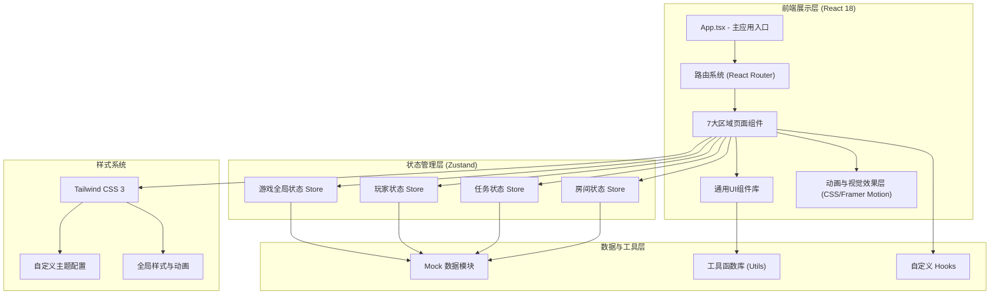
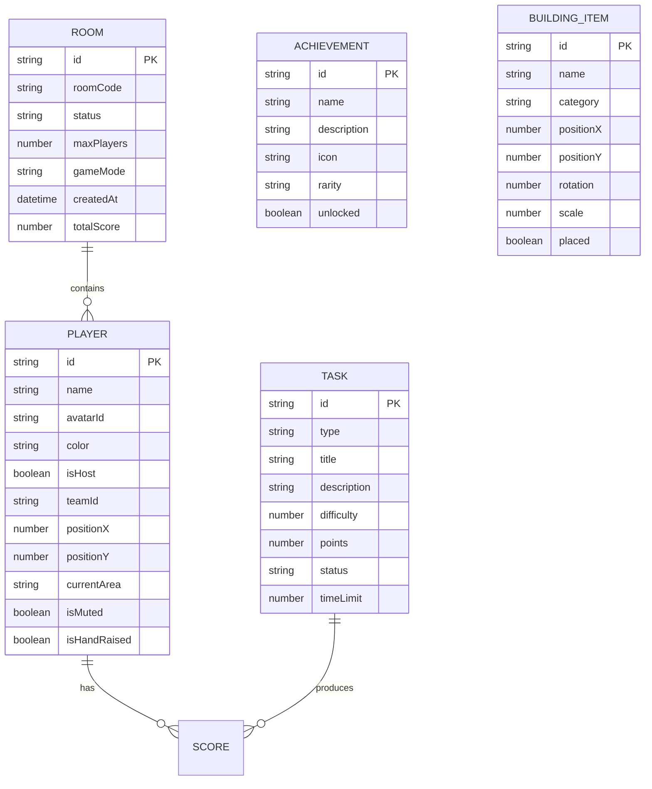

## 1. 架构设计



## 2. 技术描述
- **前端框架**: React@18 + TypeScript
- **构建工具**: Vite@5
- **样式方案**: Tailwind CSS@3 + PostCSS
- **路由管理**: React Router DOM@6
- **状态管理**: Zustand@4
- **图标库**: Lucide React
- **动画方案**: CSS 动画 + Framer Motion (可选)
- **后端**: 无（纯前端项目，使用Mock数据模拟）
- **数据**: 前端内置Mock数据 + LocalStorage持久化

## 3. 路由定义
| 路由路径 | 页面用途 |
|----------|----------|
| / | 游戏启动页/入口页 |
| /lobby | 大厅区域 - 房间管理、头像选择、设备测试 |
| /island | 岛屿主界面 - 7大区域导航中心 |
| /tasks | 任务区域 - 拼图、寻物、投票、问答 |
| /build | 建造区域 - 道具摆放、装饰合成 |
| /voice | 语音区域 - 近场聊天、表情动作 |
| /map | 地图区域 - 位置追踪、传送导航 |
| /replay | 回放区域 - 高光回看、成就墙 |
| /host | 主持区域 - 游戏控制、数据管理 |

## 4. 数据模型

### 4.1 数据模型定义



### 4.2 核心类型定义（TypeScript）

```typescript
// 玩家信息
interface Player {
  id: string;
  name: string;
  avatarId: string;
  color: string;
  isHost: boolean;
  teamId: string;
  position: { x: number; y: number };
  currentArea: GameArea;
  isMuted: boolean;
  isHandRaised: boolean;
  score: number;
}

// 游戏区域枚举
type GameArea = 
  | 'lobby' 
  | 'island' 
  | 'tasks' 
  | 'build' 
  | 'voice' 
  | 'map' 
  | 'replay' 
  | 'host';

// 房间信息
interface Room {
  id: string;
  roomCode: string;
  status: 'waiting' | 'playing' | 'paused' | 'ended';
  maxPlayers: number;
  gameMode: 'coop' | 'competitive' | 'mixed';
  players: Player[];
  totalScore: number;
}

// 任务类型
interface Task {
  id: string;
  type: 'puzzle' | 'findItem' | 'vote' | 'quiz';
  title: string;
  description: string;
  difficulty: 1 | 2 | 3;
  points: number;
  status: 'locked' | 'available' | 'inProgress' | 'completed';
  timeLimit: number;
}

// 建造物品
interface BuildingItem {
  id: string;
  name: string;
  category: 'decoration' | 'landmark' | 'functional';
  icon: string;
  position?: { x: number; y: number };
  rotation?: number;
  scale?: number;
  placed: boolean;
  unlocked: boolean;
  recipe?: { itemId: string; count: number }[];
}

// 成就
interface Achievement {
  id: string;
  name: string;
  description: string;
  icon: string;
  rarity: 'common' | 'rare' | 'epic' | 'legendary';
  unlocked: boolean;
  unlockedAt?: Date;
}

// 高光时刻
interface Highlight {
  id: string;
  timestamp: Date;
  type: 'taskComplete' | 'achievement' | 'teamWork' | 'funnyMoment';
  description: string;
  thumbnail: string;
  playerIds: string[];
}

// 游戏全局状态
interface GameState {
  currentArea: GameArea;
  isPaused: boolean;
  gameTime: number;
  tasks: Task[];
  completedTasks: string[];
  buildings: BuildingItem[];
  achievements: Achievement[];
  highlights: Highlight[];
  currentTaskId: string | null;
}
```
